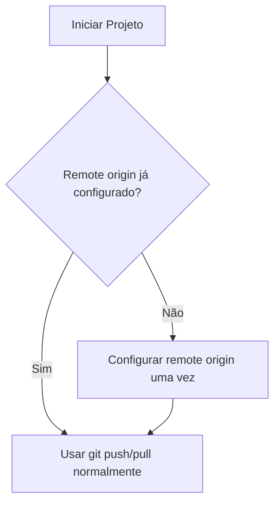

# Como configurar o remote origin do Git apenas uma vez

Ao trabalhar com Git, você só precisa configurar o repositório remoto (remote origin) uma única vez por projeto. Depois disso, basta usar os comandos git push e git pull normalmente.

## Passos para configurar

1. **Inicialize o repositório (caso ainda não exista):**
   ```sh
   git init
   ```

2. **Adicione o remote origin (apenas uma vez):**
   ```sh
   git remote add origin https://github.com/seu-usuario/seu-repositorio.git
   ```
   > Se já existir, use:
   ```sh
   git remote set-url origin https://github.com/seu-usuario/seu-repositorio.git
   ```

3. **Verifique se o remote está configurado:**
   ```sh
   git remote -v
   ```

4. **Faça push normalmente:**
   ```sh
   git push -u origin main
   ```
   Depois, basta usar `git push` e `git pull` sem precisar reconfigurar.

## Quando será necessário reconfigurar?

- Se você mudar o repositório remoto (ex: trocar de GitHub para GitLab)
- Se clonar o projeto em outro computador e quiser usar outro remote
- Se apagar a pasta `.git` ou recomeçar o projeto do zero

## Fluxo resumido



Pronto! Agora você não precisa mais repetir a configuração do remote origin a cada push.